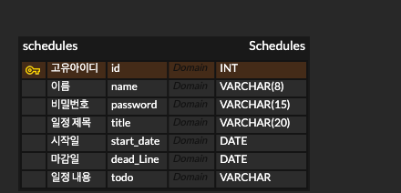

# Schedule Management

## API 명세서

### Schedule
| 기능       | Method | URL              | 상태코드                                       |
|----------|-------|-----------------|--------------------------------------------|
| 일정 생성    | POST | /schedules       | 201:정상 등록, 400:잘못된 요청 메시지                  |
| 전체 일정 조회 | GET   | /schedules      | 200:정상 조회, 404:일정을 찾을 수 없음                 |
| 선택 일정 조회 | GET   | /schedules/{id}  | 200:정상 조회, 400:잘못된 요청 메시지, 404: 일정 찾을 수 없음 |
| 선택 일정 수정 | PUT   | /schedules/{id} | 200:정상 수정, 400:잘못된 요청 메시지, 404: 일정 찾을 수 없음 |
| 일정 삭제    | DELETE | /schedules/{id}  | 204:정상 삭제, 400:잘못된 요청 메시지, 404: 일정 찾을 수 없음 |


<br>
<details>
<summary> 일정 생성</summary>

|메서드| URL        | 
|----|------------|
|POST| /schedules | 
#### Request
```
{
name : "작성자명",
password : "비밀번호",
title : "일정제목",
startDate : "YYYY-MM-DD",
deadLine : "YYYY-MM-DD",
todo : "내용"
}
```

#### Response
```
{
id : "1",
name : "작성자명",
title : "일정제목",
startDate : "YYYY-MM-DD",
deadLine : "YYYY-MM-DD",
todo : "내용"
}
```
</details>

<details>
<summary> 전체 일정 조회</summary>

| 메서드 |URL|
|-----|---|
| GET |/schedules|
#### Response
```
{
name : "작성자명",
title : "일정제목",
startDate : "YYYY-MM-DD",
deadLine : "YYYY-MM-DD",
todo : "내용"
}
```
</details>

<details>
<summary> 선택 일정 조회</summary>

| 메서드 |URL|
|-----|---|
| GET |schedules/{id}|
#### Response
```
{
id : "1",
name : "작성자명",
title : "일정제목",
startDate : "YYYY-MM-DD",
deadLine : "YYYY-MM-DD",
todo : "내용"
}
```
</details>

<details>
<summary> 선택 일정 수정</summary>

| 메서드 |URL|
|-----|---|
| PUT |schedules/{id}|

#### Request
```
{
id : "1",
title : "수정된 일정제목",
startDate : "YYYY-MM-DD",
deadLine : "YYYY-MM-DD",
todo : "수정된 내용"
}
```

#### Response
```
{
id : "1",
title : "수정된 일정제목",
startDate : "YYYY-MM-DD",
deadLine : "YYYY-MM-DD",
todo : "수정된 내용"
}
```
</details>

<details>
<summary> 일정 삭제</summary>

| 메서드    | URL|
|--------|---|
| DELETE |/schedules/{id}|
#### Resquest
```
{
password : "비밀번호"
}
```
</details>

***
### ERD

***
